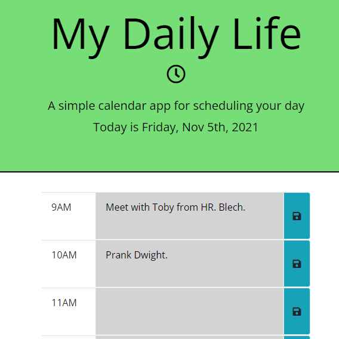

# My Daily Life

## Description

This is a daily planner app built for Week 5 of the Vanderbilt Coding Boot Camp, with the following features:

- When app is opened, the current day is displayed at the top of the calendar.
- When scrolled down, time blocks for standard business hours appear.
- Each time block is color-coded to indicate a past hour, the current hour, or a coming hour.
- When a time block is clicked, an event can be entered, which is saved in local storage for persistence.

## Table of Contents

- [Installation](#installation)
- [Usage](#usage)
- [Credits](#credits)
- [License](#license)

## Installation

Clone the repository in a CLI using the command `git clone` to download all source files.

## Usage

Upload HTML source code and asset files to hosting service such as GitHub Pages.

The landing page is hosted [here](https://branjames117.github.io/my-daily-life/).

## Credits

Developed for the Vanderbilt Coding Boot Camp.

## License

Creative Commons Zero v1.0 Universal
